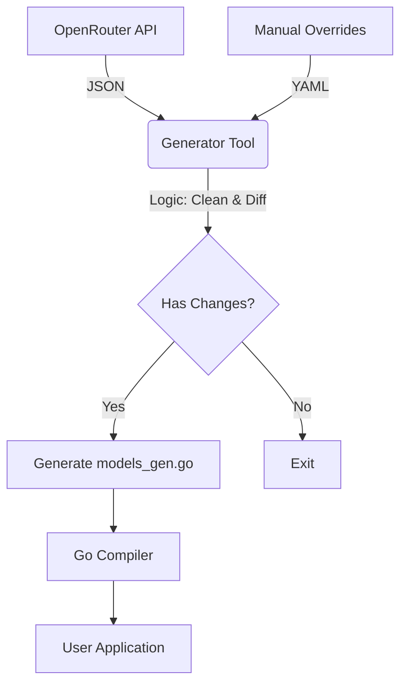

# Project Design: go-llm-specs

## 1. 项目愿景 (Vision)
构建 Golang 生态中最全、最快、类型安全的 LLM 静态元数据中心。
-   **Single Source of Truth**: 以 OpenRouter 为主数据源，结合社区维护的修正文件。
-   **Zero Runtime IO**: 所有数据编译进二进制，查询零网络延迟。
-   **High Performance**: 利用 Bitmask（位掩码）和 Indexing（索引）技术实现纳秒级查询。
-   **Self-Updating**: 利用 GitHub Actions 实现“无人值守”的自动更新与版本发布。

---

## 2. 核心架构 (Architecture)



---

## 3. 数据结构设计 (Data Structures)

为了兼顾“算法美感”与“扩展性”，我们采用 **接口暴露 + 位掩码存储** 的策略。

### 3.1 位掩码定义 (Bitmasks)
使用 `uint64` 替代 `[]string` 存储特性，极度节省内存且查询极快。

```go
package llmspecs

type Capability uint64

const (
    // 模态 (0-15 bit)
    ModalityTextIn    Capability = 1 << 0
    ModalityTextOut   Capability = 1 << 1
    ModalityImageIn   Capability = 1 << 2
    ModalityAudioIn   Capability = 1 << 3
    ModalityAudioOut  Capability = 1 << 4
    
    // 功能特性 (16-31 bit)
    CapFunctionCall   Capability = 1 << 16
    CapJsonMode       Capability = 1 << 17
    CapSystemPrompt   Capability = 1 << 18
    
    // 预留给未来扩展...
)
```

### 3.2 模型定义 (The Model Definition)
对外暴露 `Model` 接口，对内使用 `modelData` 结构体。

```go
// Model 是对外暴露的只读接口，防止外部修改内部数据
type Model interface {
    ID() string
    Name() string
    Provider() string
    Description() string // 英文描述
    DescriptionCN() string // 中文描述 (可选)
    
    ContextLength() int
    MaxOutput() int

    // 核心算法方法
    HasCapability(c Capability) bool
    Aliases() []string
}

// modelData 是内部使用的紧凑结构体
// 将会被 Generator 硬编码到 models_gen.go 中
type modelData struct {
    IDVal           string
    NameVal         string
    ProviderVal     string
    DescVal         string
    DescCNVal       string // 通过 overrides 注入
    
    ContextLenVal   int
    MaxOutputVal    int
    
    Features        Capability // 位掩码核心
    AliasList       []string
}

// 实现接口方法 (Getter)
func (m *modelData) ID() string { return m.IDVal }
func (m *modelData) HasCapability(c Capability) bool { return m.Features&c != 0 }
// ... 其他 Getter 实现
```

---

## 4. 元编程生成器设计 (The Generator)

生成器位于 `cmd/generator/main.go`，它不仅仅是 HTTP Client，更是**编译器**。

### 4.1 工作流程
1.  **Fetch**: 请求 OpenRouter API 获取全量 JSON。
2.  **Load Overrides**: 读取项目根目录下的 `data/overrides.yaml` (用于人工修正别名、补全中文描述)。
3.  **Normalize**: 
    *   清洗 Provider 名称 (如 `Alibaba`, `Qwen` 统一为 `Qwen`)。
    *   生成 Capabilities 位掩码 (解析 JSON 中的 `architecture.modality`)。
4.  **Optimization**: 
    *   构建 Trie 前缀树逻辑 (可选，V1版本可先用 Map)。
    *   生成 `aliasMap` (别名 -> 真实ID 的映射)。
5.  **Code Emit**: 使用 `text/template` 输出 `models_gen.go`。

### 4.2 生成文件预览 (`models_gen.go`)

```go
// Code generated by llm-specs-gen. DO NOT EDIT.
// Generated at: 2026-01-20 12:00:00 UTC
// Source Checksum: a1b2c3d4...

package llmspecs

// staticRegistry 存储所有静态数据
var staticRegistry = map[string]*modelData{
    "qwen/qwen-2-72b-instruct": {
        IDVal:       "qwen/qwen-2-72b-instruct",
        NameVal:     "Qwen 2 72B Instruct",
        ProviderVal: "Qwen",
        Features:    ModalityTextIn | ModalityTextOut | CapFunctionCall, 
        ContextLenVal: 32768,
        PriceInVal:  0.0000009,
        AliasList:   []string{"qwen-2-72b", "qwen2-72b"},
    },
    // ... 
}

// aliasIndex 用于快速查找别名
var aliasIndex = map[string]string{
    "qwen2-72b": "qwen/qwen-2-72b-instruct",
    "Qwen2-72B": "qwen/qwen-2-72b-instruct", // 处理大小写
}
```

---

## 5. 对外 API 设计 (Runtime API)

提供**链式调用 (Chainable API)** 的查询能力，体现库的高级感。

```go
package llmspecs

// Get 通过 ID 或 别名 获取模型
// 复杂度: O(1)
func Get(name string) (Model, bool) {
    // 1. 查别名索引
    if realID, ok := aliasIndex[name]; ok {
        return staticRegistry[realID], true
    }
    // 2. 查主表
    if m, ok := staticRegistry[name]; ok {
        return m, true
    }
    return nil, false
}

// Query 构建器模式
type QueryBuilder struct {
    provider   string
    capability Capability
    minContext int
}

func Query() *QueryBuilder { return &QueryBuilder{} }

func (q *QueryBuilder) Provider(p string) *QueryBuilder {
    q.provider = p
    return q
}

func (q *QueryBuilder) Has(cap Capability) *QueryBuilder {
    q.capability |= cap // 叠加条件
    return q
}

// List 执行查询
func (q *QueryBuilder) List() []Model {
    var results []Model
    for _, m := range staticRegistry {
        // 1. Provider 过滤
        if q.provider != "" && m.ProviderVal != q.provider {
            continue
        }
        // 2. Bitmask 极速过滤
        if q.capability != 0 && (m.Features & q.capability) != q.capability {
            continue
        }
        results = append(results, m)
    }
    return results
}
```

---

## 6. 自动化运维与发布策略 (CI/CD)

这是本库的核心生命力所在。我们只在**内容发生实质性变更**时才发布新版本。

### GitHub Actions Workflow (`.github/workflows/daily-update.yml`)

```yaml
name: Daily Model Sync

on:
  schedule:
    - cron: '0 2 * * *' # 每天凌晨 2 点运行
  workflow_dispatch:    # 允许手动触发

jobs:
  update-and-release:
    runs-on: ubuntu-latest
    permissions:
      contents: write  # 需要写权限来提交代码和发版
    
    steps:
      - name: Checkout code
        uses: actions/checkout@v4
        
      - name: Set up Go
        uses: actions/setup-go@v4
        with:
          go-version: '1.22'

      - name: Run Generator
        env:
          OPENROUTER_API_KEY: ${{ secrets.OPENROUTER_API_KEY }}
        run: |
          go run cmd/generator/main.go
          go fmt ./...

      - name: Check for changes
        id: check_changes
        run: |
          # 检查 models_gen.go 是否有变动
          if git diff --quiet models_gen.go; then
            echo "No changes detected."
            echo "changed=false" >> $GITHUB_OUTPUT
          else
            echo "Model data updated!"
            echo "changed=true" >> $GITHUB_OUTPUT
          fi

      - name: Commit and Push
        if: steps.check_changes.outputs.changed == 'true'
        run: |
          git config user.name "LLM-Bot"
          git config user.email "bot@github.com"
          git add models_gen.go
          git commit -m "feat(data): auto-update model registry [skip ci]"
          git push

      - name: Calculate Next Version
        if: steps.check_changes.outputs.changed == 'true'
        id: semver
        run: |
          # 获取最新的 tag，例如 v0.1.5
          LATEST_TAG=$(git describe --tags --abbrev=0 2>/dev/null || echo "v0.0.0")
          # 简单的 Patch 版本自增逻辑
          VERSION=${LATEST_TAG#v}
          IFS='.' read -ra ADDR <<< "$VERSION"
          major=${ADDR[0]}
          minor=${ADDR[1]}
          patch=${ADDR[2]}
          NEW_PATCH=$((patch + 1))
          NEW_TAG="v$major.$minor.$NEW_PATCH"
          echo "new_tag=$NEW_TAG" >> $GITHUB_OUTPUT

      - name: Create Release
        if: steps.check_changes.outputs.changed == 'true'
        uses: softprops/action-gh-release@v1
        with:
          tag_name: ${{ steps.semver.outputs.new_tag }}
          name: Release ${{ steps.semver.outputs.new_tag }}
          body: |
            Automatic update of LLM model data from OpenRouter.
            Check git diff for detailed changes.
        env:
          GITHUB_TOKEN: ${{ secrets.GITHUB_TOKEN }}
```

---

## 7. 开发路线图 (Roadmap)

### Phase 1: MVP (最小可行性产品)
*   [ ] 创建 GitHub 仓库结构。
*   [ ] 实现 `cmd/generator`：仅拉取 API 并保存为 JSON，用于调试结构。
*   [ ] 定义 `Bitmask` 常量和 `Model` 接口。
*   [ ] 完成 `template` 渲染逻辑，生成基础的 map。
*   [ ] 手动运行 Generator，提交第一版代码。

### Phase 2: Automation (自动化)
*   [ ] 配置 GitHub Secrets (API Key)。
*   [ ] 部署 `.github/workflows`。
*   [ ] 测试“无变更不提交”逻辑。
*   [ ] 测试“有变更自动发版”逻辑。

### Phase 3: Enhancement (增强)
*   [ ] 添加 `data/overrides.yaml` 支持，允许手动给热门模型（如 Qwen, DeepSeek）添加中文描述。
*   [ ] 实现模糊搜索算法（简单的 Contains 或 Levenshtein Distance）。

---

## 8. 总结

这个设计方案通过 **Go Generate** 实现了“动静分离”：
*   **开发时（CI）**：它是动态的，像爬虫一样活跃，捕捉最新的模型变化。
*   **运行时（User）**：它是静态的，像字典一样稳定，提供极致的性能。

它完美解决了“维护难”的问题（机器人维护），同时也解决了“性能差”的问题（预编译数据）。这是一个值得投入精力的高质量开源项目方向。